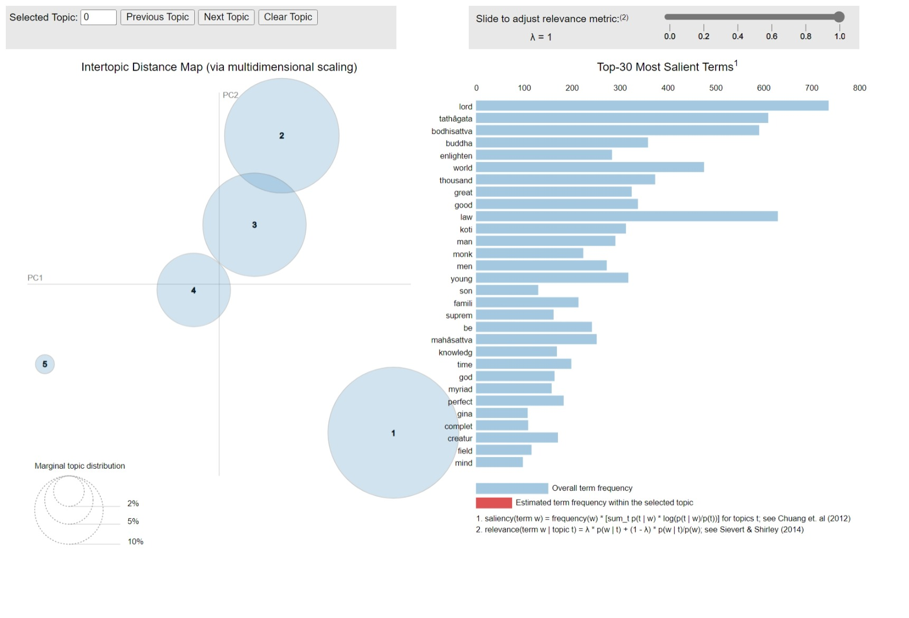

# Insights of the Lotus: Unraveling the Lotus Sutra Through Topic Modeling and Network Analysis

---

## Introduction

The Lotus Sutra, one of the most influential Mahayana Buddhist scriptures, is revered for its profound teachings on universal enlightenment and the inherent potential for awakening within all beings. It held significance influence on East Asian culture and was translated and incorporated into East Asian Buddhist schools as the final teaching of the Buddha, most prominently so in Tiantai, a major school. This research project seeks to apply network analysis and topic modeling from Hendrik Kern's English translation of the text to derive insights.

Topic modeling and network analysis have been instrumental in advancing the understanding of text in digital humanities research. Topic modeling, particularly using techniques like Latent Dirichlet Allocation (LDA), allows researchers to automatically identify latent topics and themes within textual data. This method enables the extraction of hidden patterns and structures from large text collections, providing valuable insights into the content of textual datasets.

On the other hand, network analysis has been utilized to explore relationships within textual datasets in digital humanities research. By mapping collaborations, influences, and connections among texts, network analysis offers researchers a deeper understanding of the structural relationships within textual corpora. The integration of topic modeling and network analysis has further enriched text analysis in digital humanities, combining the thematic insights from topic modeling with the structural understanding provided by network analysis.

Both topic modeling and network analysis have significantly contributed to the exploration and interpretation of textual data in digital humanities research. These computational methods have enabled researchers to uncover latent topics, visualize relationships, and gain valuable insights into the underlying themes and structures present in text collections, ultimately advancing the understanding of text in the digital humanities domain. By applying these methods on the Lotus Sutra, we may decipher the profound teachings and intricate narratives encapsulated within, thereby enriching our understanding of this seminal Buddhist scripture in the digital humanities domain.

---

## Methods

Hendrik Kern's English translation of the Lotus Sutra text can be found at [https://sacred-texts.com/bud/lotus/index.htm](https://sacred-texts.com/bud/lotus/index.htm).

The Lotus Sutra text is copied into a text file, from which the text can be extracted for preprocessing in Python. The text is first separated in two different ways: chapter and verse. That is, the first dataset contains text from each chapter, differentiated by chapter number, and the second dataset contains text from each verse, differentiated by chapter number and verse number. Stop words, punctuation, and special characters are removed, and each word is lowercased and lemmatized. 

The below visuals are word clouds of all the lemmatized words from both datasets. (Note that

The Gensim library in Python is used to create topic models with the preprocessed text. Each chapter/verse is treated as a separate document.

In our project, bigram counts are the number of times two words co-occur in a window of some length. For the chapter dataset, a bigram is counted if two words within the same chapter are separated by, at most, 19 other words, while for the verse dataset, a bigram is counted if two words co-occur within the same verse. The resulting bigram counts are then organized and stored into comma-separated values (CSV) files to be loaded into Gephi. Filters are also used so that bigrams with frequency counts of less than a set number are excluded from the data to reduce clutter in our visualizations, as well as to avoid creating oversized files.

Results of a successful project should include one or more useful network representations and topic models of the Lotus Sutra, as well as insights into the structural properties of the network, latent themes and topics present in the text, and standalone visualizations and summaries to facilitate interpretation and exploration of network analysis and topic modeling results. 

All Python notebook code used to generate the data and visualizations can be found [here](https://github.com/XiongCynthia/LotusInsights/blob/main/LotusInsights.ipynb).

All the generated data used can be found [here](https://github.com/XiongCynthia/LotusInsights/tree/main/Data).

---

## Model Results and Initial Observations

*__*Click the images to interact with the visualization!*__

### Topic Modeling: Chapters as Documents

The topics in this LDA model has a number of common salient terms. They all have the lemmas "lord," "tathâgata," "bodhisattva," "law," "world," "thousand," "good," "buddha," and "great" as one of the top 15 most salient terms for each topic. 

The assigned topics for each chapter of the Lotus Sutra by this LDA model are as follows:

- Topic 1: Chapters 7, 9, 15, 19, 20, 23, 26, and 27
- Topic 2: No chapters
- Topic 3: Chapters 1, 2, 3, 5, 8, 13, and 18
- Topic 4: Chapters 6, 10, 11, 12, 14, 16, 21, 22, and 24
- Topic 5: Chapters 4, 17, and 25

Chapters with the topic label of 1 delve into the intricate ways in which the Buddha manifests his teachings to suit the diverse capacities and inclinations of beings through comprehensive exploration of fundamental Mahayana concepts. They underscore the timeless and boundless nature of the Buddha's wisdom and compassion, offering profound insights into the nature of reality and the path to awakening, as well as the ultimate goal of attaining Buddhahood for the benefit of all sentient beings.

Topic 3 chapters have very similar themes to those of topic 1 chapters. They highlight the interconnectedness of all beings, the transformative power of the Buddha's teachings, and the ultimate goal of attaining Buddhahood for the benefit of all. They offer profound insights into the nature of reality and the path to awakening.

Topic 4 chapters generally focus on the interconnectedness of all phenomena, the emphasis on the Buddha's transformative power to liberate all beings, and the revelation of the ultimate truth of the Buddha's enlightenment. They convey the message of the boundless compassion of the Buddha, the potential for enlightenment inherent in all beings, and the ultimate goal of leading all sentient beings to awakening.

Topic 5 chapters collectively focuses on the importance of faith and active engagement. These chapters highlight the altruistic nature of Bodhisattvas like Avalokiteśvara and convey the message of universal salvation and compassion towards all sentient beings.

### Topic Modeling: Verses as Documents

The topics in this LDA model has a number of common salient terms. They all have the lemmas "law" and "world" as one of the top 15 most salient terms for each topic. There are 5 topics in this model.

At first glance, topic 1 appears to have salient terms that pertain to units of quantity (e.g., "koti," "aeon," "thousand," "number") and beings (e.g., "men," "creatur," "be," "bodhisattva").

Topic 2 has salient terms related to men (e.g., "man," "son," "king," "men") and important figures (e.g., "great," "lord," "king," "leader").

The salient terms of topic 3 are concerned with reaching some perfection (e.g., "highest," "supreme"), knowledge (e.g., "enlighten," "preach," "know," "hear," "knowledg," "think," "wise", "ignor"), and men (e.g, "son," "man," "men).

Topic 4 has salient terms about important figures (e.g., "gina," "lord," "great," "leader," "god," "honour," "sugata") and the physical world (e.g., ". Note that "gang" and "sand" most likely exists together in this topic because the original text frequently uses the phrase, "sands of the Ganges."

Lastly, topic 5 includes salient terms regarding large quantities (e.g., "thousand," "koti," "aeon"), men (e.g., "man," "son," "men," "king"), and physicality (e.g., "voic," "hear," "bodi," "smell").

### Network Analysis: Bigrams Counted Within 20 Words

For this network, we filtered all bigrams with counts of less than 1000. 

This network is heavily focused on the most frequent lemmatized words, resulting in a condensed network. Every node has direct paths to at least one node with a high degree, with very few instances of connections between low-degree nodes. Given this dominance of frequent lemmas in this network, analyses based on it would likely reflect the most frequent words used in the text.

### Network Analysis: Bigrams Counted Within Verses

For this network, we filtered all bigrams with counts of less than 10. 

Unlike previously, this network is much less condensed. In fact, there are nodes that are isolated from the main network, most of which are only connected with themselves. As a result, this network can be used to analyze more isolated patterns in the text.
